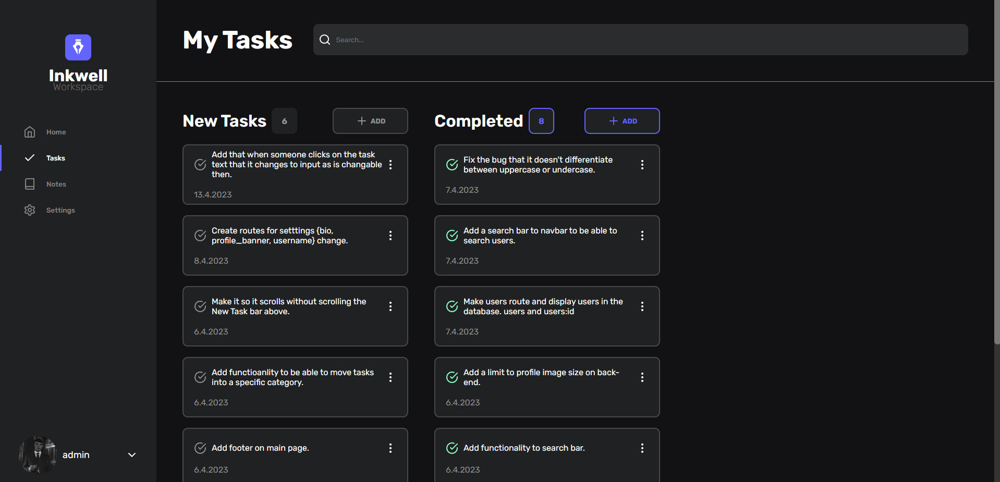

<!-- PROJECT LOGO -->
<br />
<br />
<div align="center">
  <a href="https://github.com/gymerr0rz/fs-inkwell">
    
  </a>
</div>

### 💻 Stack

- [axios](https://www.npmjs.com/package/axios): Promise-based HTTP client for making API requests.
- [bcrypt](https://www.npmjs.com/package/bcrypt): Library for hashing passwords and comparing hashes.
- [cors](https://www.npmjs.com/package/cors): Middleware for enabling Cross-Origin Resource Sharing (CORS) in Express.js.
- [dotenv](https://www.npmjs.com/package/dotenv): Loads environment variables from a .env file into process.env.
- [express](https://www.npmjs.com/package/express): Fast and minimalist web application framework for Node.js.
- [jsonwebtoken](https://www.npmjs.com/package/jsonwebtoken): Implements JSON Web Tokens (JWT) for authentication.
- [mongoose](https://www.npmjs.com/package/mongoose): Object Data Modeling (ODM) library for MongoDB and Node.js.
- [nodemon](https://www.npmjs.com/package/nodemon): Monitor for changes in the source code and automatically restart the server.

### 📝 Project Summary

- [**back-end**](back-end): Contains the back-end code for the project.
- [**back-end/controllers**](back-end/controllers): Handles the logic for different routes and interacts with models.
- [**back-end/models**](back-end/models): Defines the data models for the project.
- [**back-end/routes**](back-end/routes): Contains the route definitions for the API endpoints.
- [**front-end**](front-end): Contains the front-end code for the project.
- [**front-end/src/components**](front-end/src/components): Holds the reusable UI components used throughout the application.
- [**front-end/src/pages**](front-end/src/pages): Contains the different pages/views of the application.
- [**front-end/src/styles**](front-end/src/styles): Holds the styling files for the application.
- [**front-end/src/assets**](front-end/src/assets): Contains the static assets used in the project.
- [**front-end/public**](front-end/public): Holds the public files for the front-end build.

<!-- GETTING STARTED -->

## Getting Started

This is an example of how you may give instructions on setting up your project locally.
To get a local copy up and running follow these simple example steps.

### Prerequisites

This is an example of how to list things you need to use the software and how to install them.

- npm
  ```sh
  npm install npm@latest -g
  ```

### Installation

_Below is an example of how you can instruct your audience on installing and setting up your app. This template doesn't rely on any external dependencies or services._

1. Get a weather API Key at [Weatherapi](https://www.weatherapi.com/)
2. Clone the repo
   ```sh
   git clone https://github.com/gymerr0rz/fs-inkwell.git
   ```
3. Install NPM packages
   ```sh
   npm install
   ```
4. Create .env file and input:
   ```js
   MONGO_SRV = ''
   ACCESS_TOKEN_SECRET =
   REFRESH_TOKEN_SECRET =
   WEATHER_KEY =
   ```
